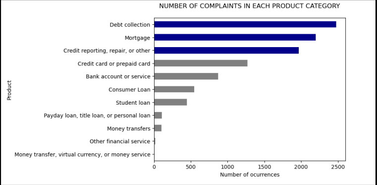

# Classification-of-Consumer-Complaints-usingDecision-tree-and-Genetic-algorithms
Classification of Consumer Complaints using Random forest and some feature selection algorithms : Genetic algorithms, Information Gain, Mutual Information.

    

